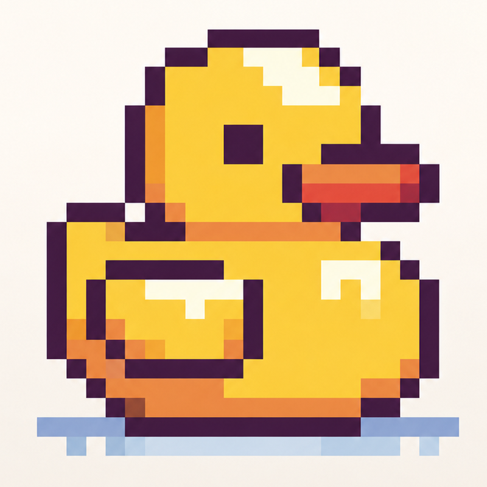

<p align="center">
  
</p>

<h1 align="center">Quack 🦆</h1>

<p align="center"><em>All shortcuts in one app. Quack Quack!</em></p>

<p align="center">
  
  
  
  
</p>

A native macOS menu-bar utility that bundles the little power-tools you'd
otherwise install five apps for: meeting countdowns & click-to-join reminders,
external-monitor brightness on the F1/F2 keys, window management by keyboard and
trackpad, pinch-to-quit on Dock icons, and a CPU temperature readout.

Lives in the menu bar (no Dock icon). Every feature is individually toggleable,
and services start **only** when their toggle is on.

---

## ✨ Features

| | Feature | What it does | Permission |
|---|---|---|---|
| 🦆 | **Menu bar** | Separate duck (opens Settings), a meeting countdown with a colored bar, and a CPU-temperature item | — |
| 📅 | **Calendar** | Next/in-progress meeting + live countdown; events in the dropdown; pick which accounts/calendars sync | Calendar |
| 🔔 | **Reminders** | Toast alerts at 20/10/5 min, plus **Join** alerts at 1 min and on-time (Zoom/Meet/Teams) — separate sounds each | Calendar |
| ☀️ | **External brightness** | F1/F2 control whichever external display the cursor is on, over DDC — with software dimming **below** the hardware floor | Accessibility¹ |
| 🪟 | **Window shortcuts** | ⌘⌥ + arrows: fill / move to the screen below / left & right halves (press again → adjacent monitor) | Accessibility |
| ✋ | **Window swipe** | Two-finger title-bar swipe: ↑ fullscreen, ↓ minimize, ←→ snap to half | Accessibility |
| 🔥 | **Dock pinch-to-quit** | Pinch-in on an app's Dock icon to quit it | Accessibility |
| 🌡️ | **CPU temperature** | Flame + live temperature (°C/°F) read from the Mac's sensors, à la `hot` | — |

¹ The brightness slider works without Accessibility; only intercepting F1/F2
needs it (to consume the key so the built-in display doesn't also change).

---

## 📦 Requirements

- **macOS 13 Ventura** or later
- **Apple Silicon** for external brightness (DDC over `IOAVService`); Intel runs everything else
- A display that supports **DDC/CI** — Settings shows "DDC supported / not supported" per display

---

## 🚀 Install

Builds with **Swift Package Manager** — no full Xcode, just Command Line Tools
(`xcode-select --install`).

```bash
./Scripts/install.sh
```

This quits any running copy, builds a release bundle, installs it to
`/Applications/Quack.app`, and relaunches it (Settings opens on launch). Click
the duck → enable what you want.

> **Always run via `install.sh` / the installed copy.** macOS ties Accessibility
> & Calendar grants to the bundle id + signature at a fixed path. Running from
> the build folder makes grants silently stop working. The stable
> "Quack Local Signing" identity keeps grants across rebuilds.

**Other scripts**

```bash
swift test                 # logic tests (no hardware needed)
CONFIG=release Scripts/build-app.sh   # build build/Quack.app
Scripts/package-dmg.sh     # wrap it in a drag-to-Applications DMG
Scripts/make-icon.sh       # regenerate the .icns from Resources/AppIcon-source.png
```

---

## 🎛️ Usage

- **Duck** — click to open Settings. Hide it via **General → Hide duck icon**.
- **Brightness** — cursor on an external display, press **F1/F2**. Past the
  monitor's minimum it keeps dimming with a software overlay. A native-style HUD
  shows the level.
- **Window shortcuts** — `⌘⌥ + ↑` fill, `↓` move to the screen below, `←`/`→`
  left/right half; press a direction again to jump to the adjacent monitor.
- **Window swipe** — point at a title bar, swipe two fingers: up = fullscreen,
  down = minimize, left/right = snap to that half.
- **Dock pinch** — point at an app's Dock icon and pinch-in to quit it.
- **Reminders** — pick lead times under **Calendar → Reminders**; 20/10/5 are
  plain notifications, 1-minute and on-time show a **Join** button. Each group
  has its own sound (previewed on selection) and a **Preview** button.
- **Temperature** — toggle under **CPU**; click the flame for thermal pressure +
  exact reading.

---

## 🔐 Permissions

- **Calendar** — requested when you enable calendar features.
- **Accessibility** — for F1/F2 routing, window shortcuts, swipe, and dock
  pinch. Can't be granted programmatically: click **Grant**, flip Quack on in
  System Settings → Privacy & Security → Accessibility. Quack picks it up live.

Each Settings section has an **Open Settings** deep-link if you ever deny one.

---

## 🏗️ Architecture

```
QuackKit (library, fully unit-tested — no system/UI deps)
  Models/      MeetingEvent, QuackSettings, MeetingProvider
  Calendar/    CalendarProvider, MeetingSelection, MeetingStore, MeetingURLParser
  MenuBar/     CountdownFormatter
  Display/     ScreenGeometry, TrackpadSwipe, BrightnessMath
  Coordinator/ AppCoordinator, ManagedService, Feature
  Permissions/ PermissionStatusMapper · Settings/ SettingsStore

Quack (executable — SwiftUI + AppKit)
  MenuBar/   StatusItemController (duck + countdown), TemperatureStatusItem, MenuContentView
  Calendar/  EventKitProvider, CalendarRefreshService
  Reminders/ ReminderScheduler · Toast/ ToastPresenter
  Display/   CursorBrightnessService, BrightnessKeyTap, BrightnessController,
             DisplayDimmer, BrightnessHUD, DDCControl
  Windows/   HotkeyMonitor, GestureMonitor, EventTapThread, WindowMover,
             DockPinchMonitor, DockAccessibility, AXHelpers, InputTaps
  Settings/  SettingsView

C targets (private-API shims, no sandbox)
  CDDC         DDC/CI brightness via IOAVService (m1ddc-style)
  CMultitouch  raw trackpad pinch via MultitouchSupport (dlopen)
  CSMC         CPU temperature via SMC + IOHID
```

All decision logic lives in `QuackKit` behind protocols and pure functions, so
it's unit-testable without hardware or permissions; the app target wires it to
the live frameworks. An `AppCoordinator` starts/stops each service as its flag
flips, so a disabled feature never triggers a permission prompt.

---

## 📤 Sharing / distribution

`Scripts/package-dmg.sh` produces a drag-to-Applications DMG. It's signed with a
local identity, so a friend opens it via **right-click → Open** the first time
(or `xattr -dr com.apple.quarantine /Applications/Quack.app`).

For zero Gatekeeper warnings, sign with a **Developer ID** and notarize:

```bash
SIGN_ID="Developer ID Application: Your Name (TEAMID)" CONFIG=release Scripts/build-app.sh
Scripts/package-dmg.sh
xcrun notarytool submit build/Quack.dmg --apple-id you@example.com --team-id TEAMID --password "app-specific-pw" --wait
xcrun stapler staple build/Quack.dmg
```

**No App Sandbox** by design — it would block DDC over IOKit and cross-app
Accessibility window moves — so Quack ships as a notarized DMG, not via the App
Store.
